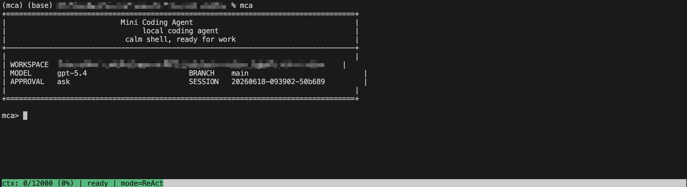
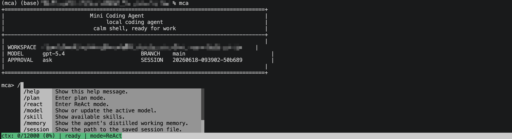
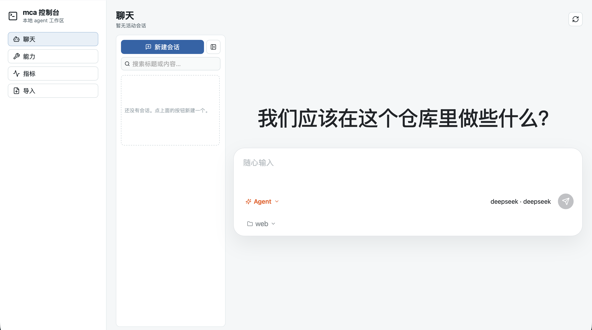
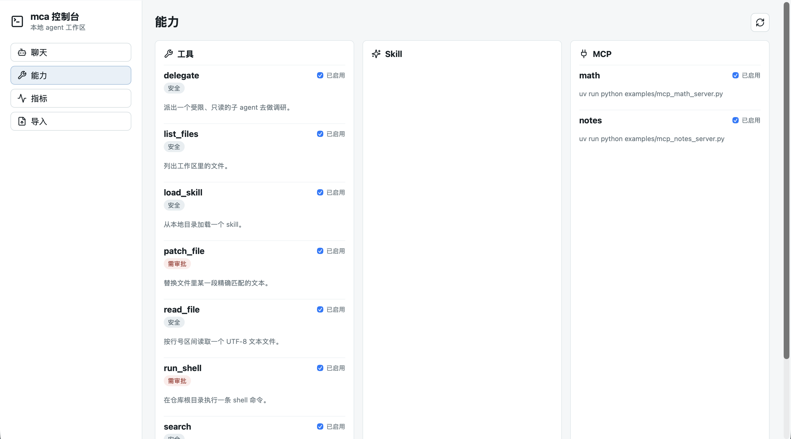
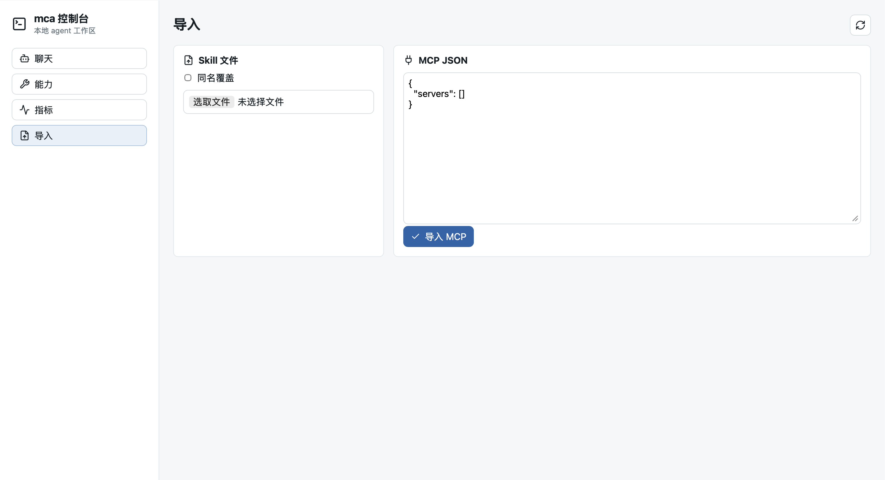
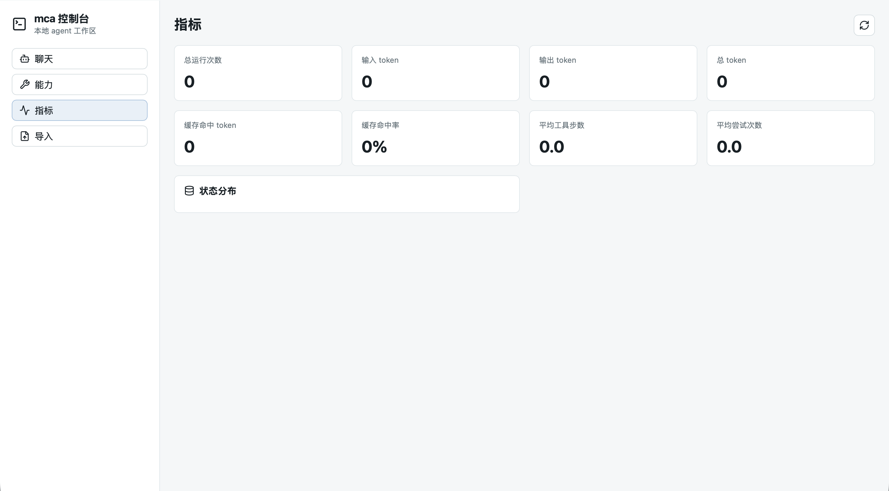

# Mini Coding Agent

> 一个面向本地开发的编码智能体。

Mini Coding Agent 是一个面向本地开发的小型编码智能体。它支持命令行交互、会话持久化、上下文管理、任务状态记录、Skills 和 MCP 服务等。

## 项目功能

- **终端和Web两种启动方式**: 支持 CLI 启动和 Web 启动。
- **多模型支持**: 支持 Ollama、OpenAI、Anthropic 和 DeepSeek 风格模型配置。
- **多层结构化记忆管理**：
- **会话保存和恢复**: 支持任务运行状态、会话上下文保存和恢复。
- **MCP、Skills支持**: 支持导入MCP和Skills。

## 项目演示

### CLI 启动：
**启动界面：**



**帮助选项：**



### Web 管理界面：

**首页：**


**Skills 管理：**


**MCP 导入：**


**运行日志：**


## 项目流程

```text
User / CLI / Web Console
        |
        v
mca runtime
        |
        +--> context manager
        +--> workspace tools
        +--> memory and run store
        +--> MCP tool clients
        |
        v
LLM provider
```

Agent 运行时读取用户任务和工作区上下文，按配置调用模型，并将任务状态、上下文窗口和工具结果写入本地 run store。MCP 示例服务用于验证外部工具协议，不默认执行高风险系统操作。

## 技术栈

- **后端**: Python 3.10+, FastAPI, prompt-toolkit, PyYAML
- **前端**: React, Vite, TypeScript, lucide-react

## 快速开始

```bash
git clone https://github.com/m4rklee/mini-coding-agent.git
cd mini-coding-agent
python -m venv .venv
source .venv/bin/activate
pip install -e .
pip install pytest ruff
```

配置模型环境变量：

```bash
cp .env.example .env
```

启动 CLI：

```bash
mca
```

或直接通过模块运行：

```bash
python -m mca
```

## 网页控制

```bash
cd web
npm install
npm run dev
```

## 项目结构

```text
mca/                    # 核心代码
examples/               # MCP样例
benchmarks/             # Benchmark测试数据
web/                    # 网页前端
docs/                   # 相关文档
```
