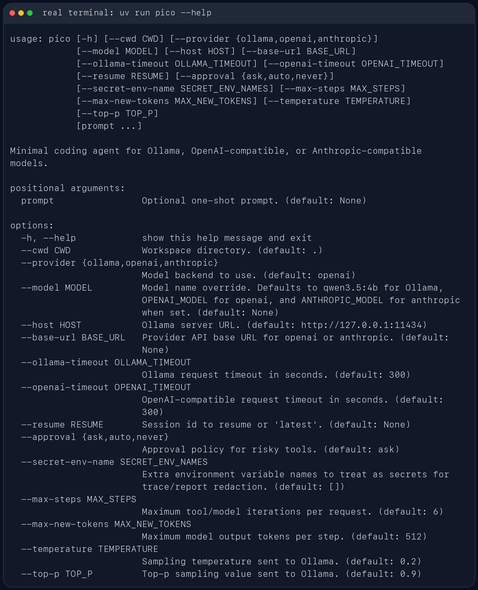

# mini coding agent

`mca` 是一个面向代码仓库的轻量本地 coding agent（mini coding agent，缩写为 `mca`）。它直接跑在终端里，先看当前工作区，再用一组受约束的工具去读文件、改文件、跑命令，并把会话状态保存在本地 `.mca/` 目录里。

它更像一个能在仓库里持续工作的命令行助手，不是纯聊天窗口。你可以拿它做代码排查、测试修复、仓库分析，或者让它在当前项目里执行一次性的工程任务。

## 适合做什么

- 在本地仓库里排查测试失败
- 读取当前代码结构并给出修改建议
- 基于现有文件做小步迭代，而不是脱离仓库空想
- 在会话中保留上下文，支持继续上一次工作

## 主要特性

- 包名是 `mca`
- CLI 命令是 `mca`
- 模块入口是 `python -m mca`
- 会话保存在 `.mca/sessions/`
- 每次运行的工件保存在 `.mca/runs/<run_id>/`
- 支持四类模型后端：
  - Ollama
  - OpenAI 兼容 Responses API
  - Anthropic 兼容 Messages API
  - DeepSeek Anthropic 兼容 API

## 使用截图

CLI 帮助信息：



启动界面：


REPL 内置命令与会话路径：


## 安装

需要 Python 3.10+。

如果你用 `uv`，直接安装依赖：

```bash
uv sync
```

如果你已经在自己的 Python 环境里工作，也可以直接装成可编辑模式：

```bash
pip install -e .
```

## 快速开始

在当前仓库里启动交互模式。当前推荐使用 DeepSeek：

```bash
uv run mca --provider deepseek
```

指定另一个工作目录：

```bash
uv run mca --cwd /path/to/repo
```

直接跑一次性任务：

```bash
uv run mca --provider deepseek "inspect the test failures and propose a fix"
```

如果当前环境已经安装过包，也可以直接这样启动：

```bash
python -m mca --provider deepseek
```

## 模型后端

mca 启动时会读取项目根目录的 `.env`。本地真实 key 放在 `.env`，仓库只保留 `.env.example`。配置优先级是：

```text
显式 CLI 参数 > .env 里的 MCA_* 变量 > 旧环境变量 > 代码默认值
```

本地第一次配置：

```bash
cp .env.example .env
```

然后把要使用的 provider key 填进去。`.env` 已经被 `.gitignore` 忽略，不要提交真实 key。

### Ollama

```bash
ollama serve
ollama pull qwen3.5:4b
uv run mca --provider ollama --model qwen3.5:4b
```

### OpenAI 兼容接口

默认 OpenAI 兼容接口使用 right.codes 的 Codex endpoint：

```bash
MCA_OPENAI_API_BASE="https://www.right.codes/codex/v1"
MCA_OPENAI_API_KEY="your-api-key"
MCA_OPENAI_MODEL="gpt-5.4"
```

也可以改成其他 OpenAI-compatible 服务：

```bash
MCA_OPENAI_API_BASE="https://your-api.example/v1"
MCA_OPENAI_API_KEY="your-api-key"
MCA_OPENAI_MODEL="gpt-5.4"
```

```bash
uv run mca --provider openai
```

### Anthropic 兼容接口

默认 Anthropic 兼容接口使用 right.codes 的 Claude endpoint：

```bash
MCA_ANTHROPIC_API_BASE="https://www.right.codes/claude/v1"
MCA_ANTHROPIC_API_KEY="your-api-key"
MCA_ANTHROPIC_MODEL="claude-sonnet-4-6"
```

```bash
uv run mca --provider anthropic
```

如果你的服务端对多个兼容接口复用了同一套密钥，`mca` 也支持从 `MCA_ANTHROPIC_API_KEY` 回退到 `ANTHROPIC_API_KEY`、`MCA_RIGHT_CODES_API_KEY`、`RIGHT_CODES_API_KEY`、`MCA_OPENAI_API_KEY` 或 `OPENAI_API_KEY`。

### DeepSeek

```bash
MCA_DEEPSEEK_API_KEY="your-api-key"
MCA_DEEPSEEK_MODEL="deepseek-v4-pro"
```

```bash
uv run mca --provider deepseek
```

默认 DeepSeek base URL 是 `https://api.deepseek.com/anthropic`，走 DeepSeek 的 Anthropic 兼容接口。如果需要改到代理服务，可以设置 `MCA_DEEPSEEK_API_BASE` 或启动时传 `--base-url`。

## 常用交互命令

- `/help`：查看内置命令
- `/memory`：查看提炼后的工作记忆
- `/session`：查看当前会话文件路径
- `/reset`：清空当前会话状态
- `/exit` 或 `/quit`：退出 REPL

## Web 控制台

`mca` 也提供一个本地 Web 控制台，用来在浏览器里和 agent 交互、查看工具/skill/MCP、导入配置、浏览历史会话并查看 token 使用统计。

第一次使用先构建前端资源：

```bash
cd web
npm install
npm run build
cd ..
```

然后启动本地控制台：

```bash
uv run mca web --cwd . --host 127.0.0.1 --port 8765 --provider deepseek --approval ask
```

打开：

```text
http://127.0.0.1:8765
```

控制台默认只绑定 `127.0.0.1`，没有内置登录认证，不要把它暴露到公网或共享网络。危险工具仍沿用审批模式；使用 `--approval ask` 时，页面会弹出确认框。

### MCP JSON 导入

Web 控制台的 MCP 导入接受 JSON 配置：

```json
{
  "servers": [
    {
      "name": "notes",
      "command": "uv",
      "args": ["run", "python", "examples/mcp_notes_server.py"],
      "env": {},
      "enabled": true
    }
  ]
}
```

导入后配置保存在 `.mca/config/mcp_servers.json`。同名 server 默认会返回冲突，需要在页面勾选覆盖确认。

### Skill 导入

Skill 导入接受单个 `SKILL.md` 文件，并要求 frontmatter 至少包含：

```markdown
---
name: hello
description: A short description.
---

## Instruction

...
```

导入后文件会保存到 `skills/<name>/SKILL.md`。

## 安全与持久化

`mca` 不会默认把所有动作都放开。像 shell 执行、文件写入这类高风险操作，会受审批模式控制：

- `--approval ask`
- `--approval auto`
- `--approval never`

每次运行结束后，都会在 `.mca/runs/<run_id>/` 下写出这些文件：

- `task_state.json`
- `trace.jsonl`
- `report.json`

这些内容默认只保存在本地，不需要跟仓库一起提交。

## 开发

如果装了 Ruff，可以这样检查：

```bash
uv run ruff check .
```
